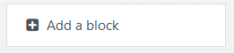

# Moodle Plugin block_edutechpreferences

## Overview
This plugin allows teachers to easily identify the needs of accessible content required by the students of each of their courses through a preference report.

Students will be able to define their content preferences according to their accessibility needs.

Also, the teacher will be able to visualize recommendations of free accessible learning objects available in the [EduTech Repository](https://repositorio.edutech-project.org/).

## Installation in a Moodle Platform
- 1.- Copy this repository code inside your Moodle path:  "/moodle/blocks/edutechpreferences/".
- 2.- Login into your Moodle platform as an Administrator and follow the steps to proceed with the plugin installation.
- 3.- Add a new block "Edutech Preferences" within any Moodle Course.

.

## How to use
Students must click the block's option "Edit Preferences", to access the form where they will be able to select their accessibility preferences.
After the information is saved they will see the selected preferences within the block.

If any student enrolled to a course, has answered the content preferences form, teachers will be able to see an anonymous report with the content preferences filled by the course students.

Inside the block, teachers will be able to get a summary report with recommendations of accessible content preferences. Teachers will be able to search those recommendations in the  [EduTech Repository](https://repositorio.edutech-project.org/) to get access to free accessible learning objects and use them within their Moodle courses.
